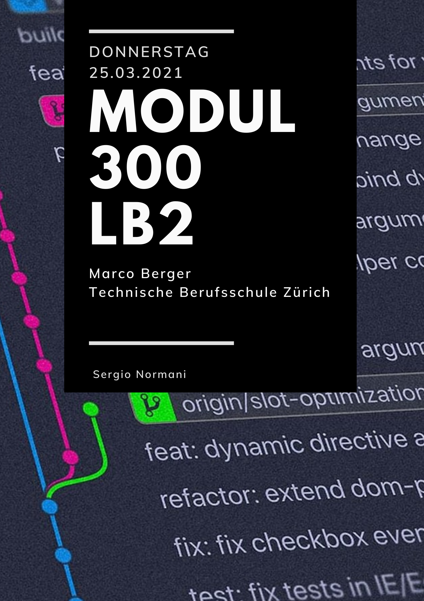

## Inhaltsverzechnis
1. [Einleitung](#Einleitung)
2. [Grafische Übersicht mit Visio](#Visio)
3. [Konfigurationen](#Konfigurationen)
4. [Code im Detail](#Code)
5. [Testen](#testen)
6. [Quellenverzechnis](#Quellen)

## Einleitung 
Am 05.02.2021 durfte die ST18d mit dem neuen Modul "Plattformübergreifende Dienste im Netzwerk integrieren" beginnen. Zu Beginn gab es eine intensive Einführung und dazu haben wir die Toolumgebung aufgesetzt. Dies war die Voraussetzung für die LB2. 

Da wir nun die nötigen Informationen zur LB2 erhalten haben, stand uns grundsätzlich nichts mehr im Wege mit dem Projekt zu starten.

Ich habe mich dafür entschieden, einen Webserver mit Ubuntu zu ertsellen. Das Projekt war nicht allzu kompliziert, jedoch erfüllt es seinen Zweck. Eine VM (Virtualbox) wird nach dem "vagrant up" Befehl gestartet. Danach wird ein Skript erstellt, welches die Systemprozesse anzeigt. Dazu kommt dass die Daten mit Hilfe eines Cronjob immer aktuell bleiben.

## Grafische Übersicht mit Visio 

## Konfigurationen 

## Code im Detail 

## Testen 

## Quellenverzeichnis 

-Template für Vagrantfile